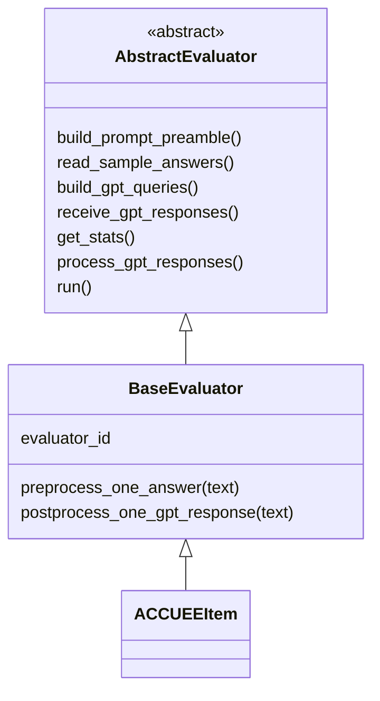
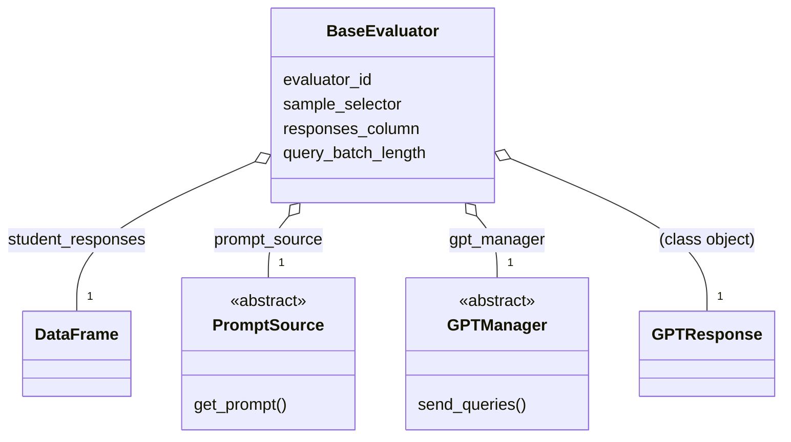
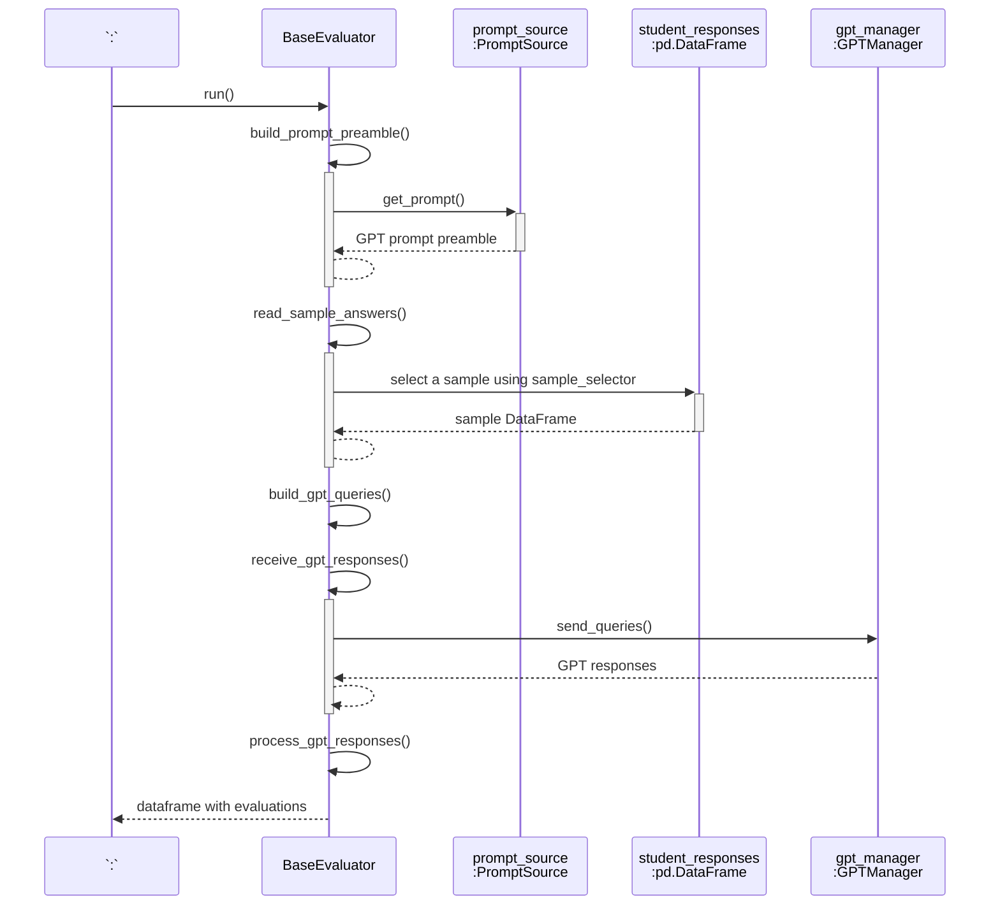
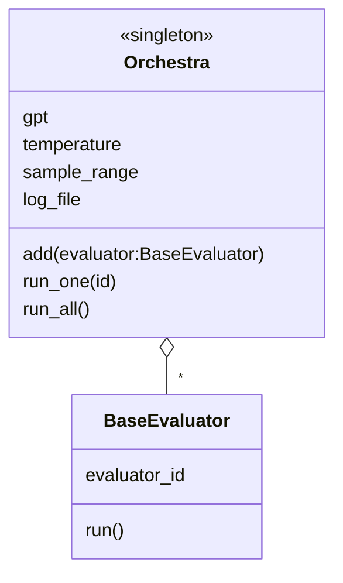
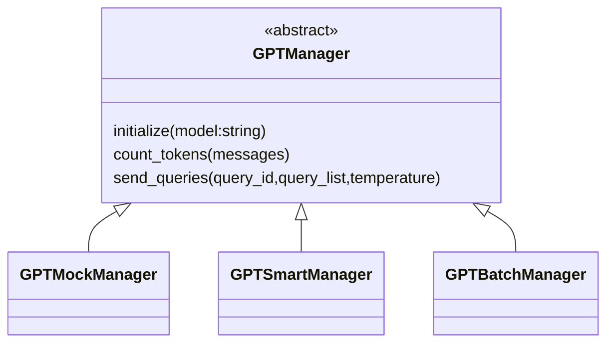

# Descripción del sistema

## Tabla de contenido
- [Evaluadores (evaluators)](#evaluadores-evaluators)
- [clase Orchestra (catálogo de evaluadores)](#orchestra)
- [GPT Managers](#gpt-managers)

## Vocabulario

- __Item.__ Un ítem es el diseño de una pregunta o ejercicio evaluable.
- __Student answer.__ Respuesta individual de un estudiante a un ítem.
- __GPT query.__ Objeto JSON que se envía a GPT, con la API de OpenAI.
- __GPT response.__ Objeto JSON que llega como respuesta desde GPT.

## Evaluadores (evaluators)

### Jerarquía de clases



### BaseEvaluator: evaluador básico
Un `BaseEvaluator`está compuesto de varios objetos,
cada uno de los cuales tiene una responsabilidad dentro del
procesamiento de las respuestas.

Esta clase es plenamente funcional y se puede utilizar directamente. 
No obstante, su propósito es servir como clase base para especializar
el comportamiento de cada ítem o modalidad concreta de evaluación.



### El DataFrame con las respuestas de estudiantes
El campo `student_responses` es un DataFrame de pandas
cuya primera columna deben ser las respuestas de los estudiantes,
que el `BaseEvaluator` evaluará.

Se puede elegir cualquier otra columna del DataFrame, dando valor al atributo `responses_column`. Admite tanto un valor entero como un `str` con el nombre de la columna.

La operación `BaseEvaluator.process_gpt_responses()` tomará una muestra
de `student_responses` (seleccionada mediante `sample_selector`),
la procesará con GPT según el _prompt_ definido en `prompt_source`, 
y como resultado devolverá un DataFrame idéntico a la muestra, añadiendo
dos columnas al final:

- una columna con la calificación de GPT.
- una columna con la descripción detallada de la calificación.


### Operación BaseEvaluator.run()

Cómo se resuelve la operación `BaseEvaluator.run()`.



### Selector de muestras: BaseEvaluator.sample_selector

La clase `BaseEvaluator` tiene un mecanismo muy potente para poder seleccionar
muestras dentro del DataFrame con las respuestas de estudiantes.

La selección de muestras se realiza con el campo `sample_selector`, que puede ser 
uno de estos tipos:

- Un valor entero, que sirve para seleccionar una muestra aleatoria. Ej.: `item.sample_selector = 33` 
  selecciona 33 respuestas al azar.
- Un _slice_. Ej.: `item.sample_selector = slice(1,12,3)` selecciona las respuestas 1, 4, 7 y 10.
- Una lista. Ej.: `item.sample_selector = [ 1, 17, 42, 25 ]`
- Una expresión lambda que filtre sobre un DataFrame. Ejemplos:
  - `item.sample_selector = lambda df : df.sample(n=20,random_state=42)`
  - `item.sample_selector = lambda df : df[df["Calificación 15"]==1]`
- En general, cualquier valor que implemente el comportamiento `callable` sobre el DataFrame.

Si `sample_selector` es `None`, se devuelve el DataFrame completo.

## Orchestra: el catálogo de evaluadores <a name="orchestra">
El objeto `orchestra` contiene todos los evaluadores que se 
usarán en los tests.



Según vayamos elaborando objetos evaluadores, los vamos incorporando a `orchestra`
mediante `orchestra.add(eva)`. Cuando queramos ejecutar todos los evaluadores,
invocamos a `orchestra.run_all()`. A todos los evaluadores se les aplicará la 
configuración definida en `orchestra`: 
una selección muestral, un GPTManager y una temperatura.

## GPT managers

La clase `GPT Manager` es una interfaz hacia GPT. Dependiendo de la implementación 
de la clase, puede ofrecer contención de paquetes, para evitar violar los 
límites de OpenAI sobre número de tokens por minuto y otras restricciones. 
También puede reintentar automáticamente el envío de mensajes cuando se observa 
falta de respuesta desde OpenAI.

Las clases disponibles son:

- __GPTMockManager.__ No dialoga con OpenAI. Sirve para testear otros módulos,
cuando no hace falta recibir respuestas reales de OpenAI.
- __GPTSmartManager.__ La interfaz síncrona con OpenAI, con contención de 
ancho de banda, reintentos, etc.
- __GPTBatchManager.__ La interfaz asíncrona con OpenAI _(Batch API)_, que deja tareas en segundo plano que se reciben de forma asíncrona.



La operación `send_queries()` envía un lote de peticiones, cada una en el formato
JSON de OpenAI (Chat.Completions). Devuelve una tupla con estos dos objetos:

- la lista de respuestas recibidas desde GPT.
- las estadísticas de tokens consumidos y tiempo invertido.

### Testeo sin usar GPT (gpt_mock_manager)

Para hacer pruebas sin interactuar con GPT se ha preparado un módulo `gpt_mock_manager.py` que
tiene la misma interfaz que `gpt_manager.py`, pero en lugar de hablar con ChatGPT, devuelve respuestas
tontas. El módulo está en el directorio `tests`.

En el código fuente, donde se crea cualquier GPTManager, se puede sustituir por esto:

```python
from gpt_manager import GPTMockManager as GPTManager
```

y utilizar un objeto de la clase `GPTManager` para simular el diálogo con GPT.

Si se utiliza `gpt_factory`, se puede seleccionar el _mock_ de esta forma:

```python
gpt = gpt_factory.select_model("mock")
```
